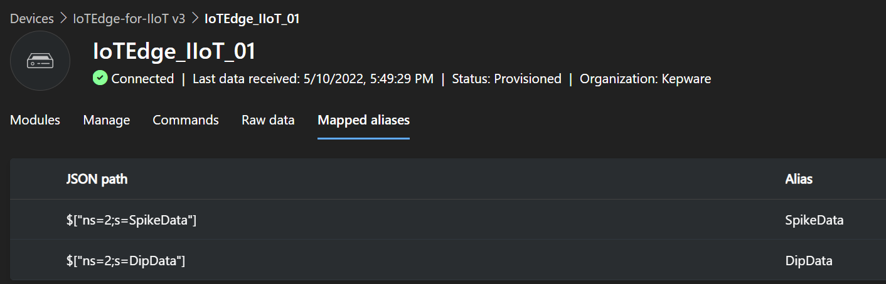
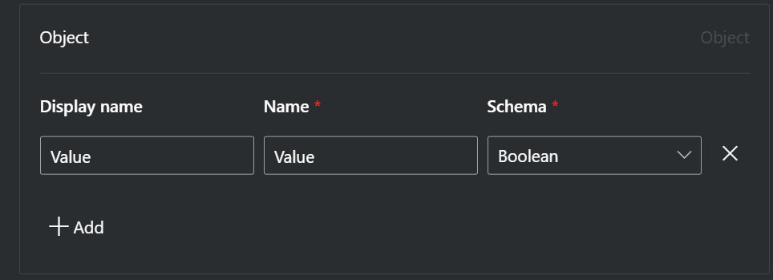
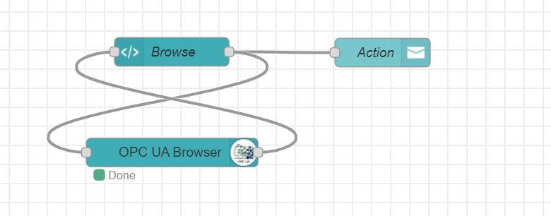
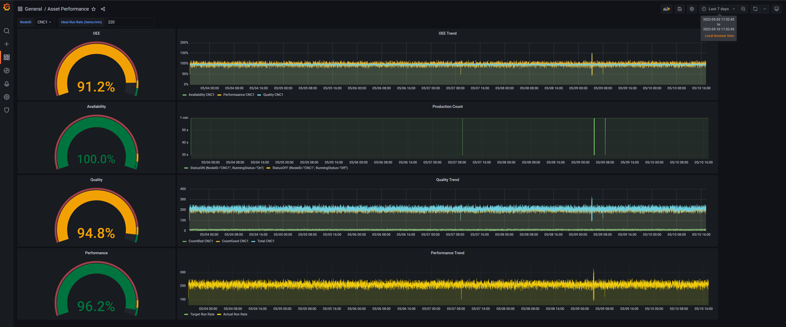
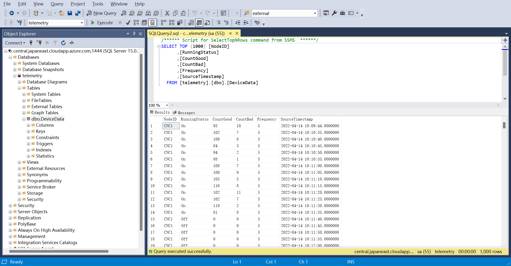
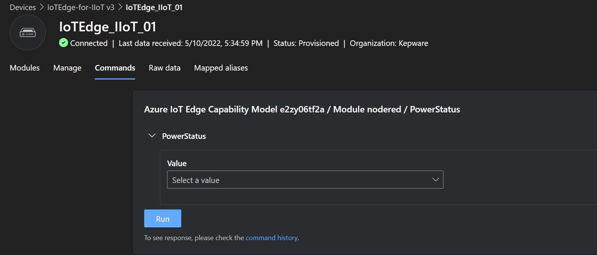
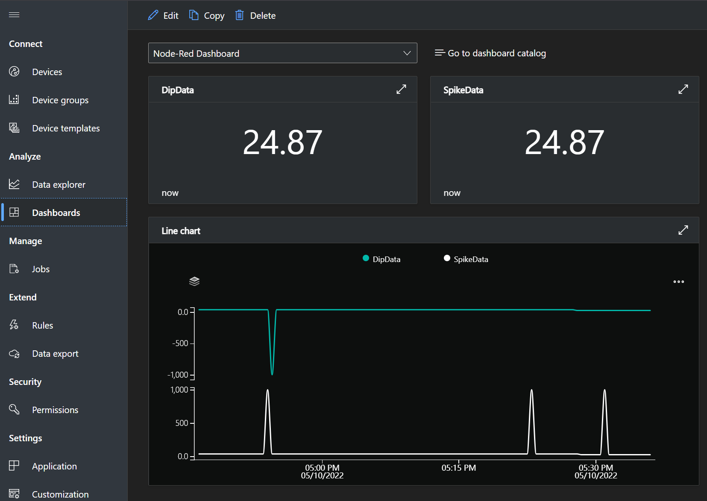
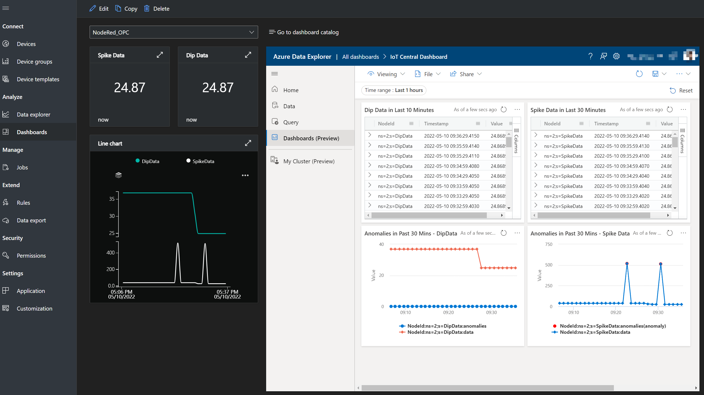
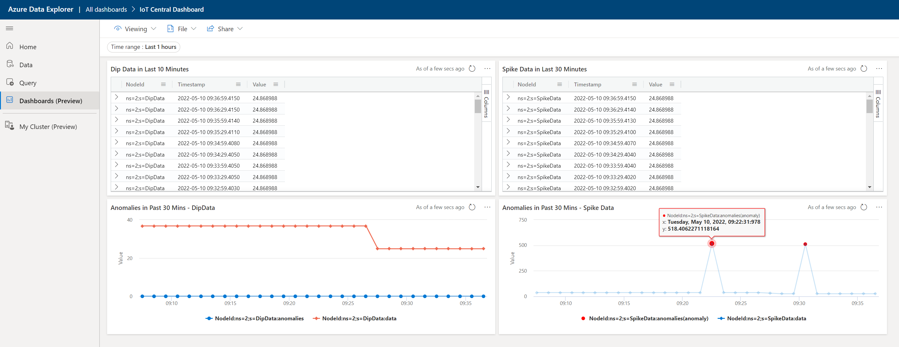

### Content:
1. [Introduction](#introduction)
2. [Prequisitions](#prequisitions)
3. [Steps](#steps)
4. [Screenshots](#screenshots)

### Introduction: 
1. This [flow.json](./flows.json) contains several flows consolidate into 1 file, they are:
    - PLC (OPC-UA) to IoT Central (as a device or as an edge device)
    - Receive reserve control from IoT Central
    - Kepware (OPC-UA) to local Azure SQL Edge, and using grafana to display OEE with local dashboard
    - OPC-UA NodeID explorer in Dashboard
2. Multi iot edge modules are deployed, they are:
    - Simulated PLC, OPC-UA communication supported, exposed port: 50000
    - Edge Device Monitor agent
    - Azure SQL Edge, exposed port: 1444
    - Grafana, exposed port: 3333
    - Node-Red, exposed port: 1888
3. We will use another Windows VM as Industrial PC environment, and KepServer running on this machine.
4. The IoT Edge Metrics Collector will monitor local device status and send logs to Azure Log Analytics, with a build-in dashboard can be viewed on Azure.
5. Data from PLC/Kepware will send to IoT Central for short-term storage and visualization(30 days), another copy will store in Azure Data Explorer (ADX), we will perform anomaly detection of the telemetry using this tool.
6. We will using PowerApps and PowerAutomate to view telemetry from ADX and control PLC/Kepware through IoT Central.

### Prequisitions:
1. Start a virtual machine, ubuntu 18.04 LTS or 20.04 LTS, deploy Azure IoT Edge runtime follow this [document to choose your evironment and authentication methods](https://docs.microsoft.com/en-us/azure/iot-edge/how-to-create-iot-edge-device?view=iotedge-2020-11) or [quickstart on Linux VM using symmetric keys](https://docs.microsoft.com/en-us/azure/iot-edge/how-to-provision-single-device-linux-symmetric?view=iotedge-2020-11&tabs=azure-portal%2Cubuntu)
2. Login to you created VM, create folders in your preferred location using `mkdir`, 3 folders need to create: grafana, sqledge and nodered
3. Edge the enclosure file: [iotedge deployment.json](./iotedge%20deploy.json) and modify the 
    - Line 9 (Local IP); 
    - Line 20 (Local Folder for nodered); 
    - Line 41 (Local Folder for grafana); 
    - Line 62, 68, 71 ([follow this document](https://docs.microsoft.com/en-us/azure/iot-edge/how-to-collect-and-transport-metrics?view=iotedge-2020-11&tabs=iothub)); 
    - Line 83 (Local Folder for sqledge); 
    - Line 92 (SQL SA Password); 
4. Connect to Azure SQL Edge deployed in Azure IoT Edge and create table with 90 days retention follow this [SQL Script](./SQL%20Script.sql)
5. Create an IoT Central application, follow this [document](https://docs.microsoft.com/en-us/azure/iot-central/core/howto-create-iot-central-application)
6. Create Azure Data Explorer Cluster in Azure Portal

### Steps:
1. Deploy Modules to Azure IoT Edge in IoT Central follow this [document](https://docs.microsoft.com/en-us/learn/modules/connect-iot-edge-device-to-iot-central/4-deploy-iot-edge-to-virtual-machine)
2. Import the flow.json into Module Node-Red.
3. Click Deploy in upper right corner.
4. Create Data Export fro Azure IoT Central to Azure Data Explorer using following transformation script: </br>
    ```json
    {
    "NodeId": .telemetry[1].name,
    "Timestamp": .telemetry[1].value.["Timestamp"],
    "Value": .telemetry[1].value.["Value"]
    }
    ```
5. Create alias as showed below:</br> </br></br>
6. Update template nodered in Device Template:</br>
    </br></br>
    

### Screenshots:
1. Node-Red Flows - OEE:</br>  </br></br>
2. Node-Red Flows - Reverse Control:</br> </br></br>
3. Node-Red Flows - KepServer/PLC to IoT Central:</br> </br></br>
4. Node-Red Flows - OPC-UA NodeID Explorer:</br>  </br></br>
5. OEE with Grafana:</br> </br></br>
6. Azure SQL Server with SQL Server Management Studio:</br> </br></br>
7. IoT Central Screenshots - Control:</br> </br></br>
8. IoT Central Screenshots - Dashboard:</br> </br></br>
8. IoT Central Screenshots - Dashboard with ADX integration:</br> </br></br>
9. Azure Data Explorer Aomalies Dashboard:</br> </br></br>