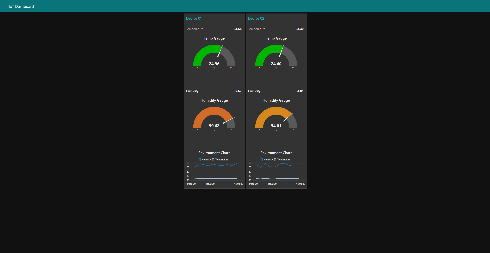

# Generate Random data and send to IoT Hub with Dashboard
Open the file `flow.json` and copy all (or Ctrl+A) then paste to the [Palette Manager](https://nodered.org/docs/user-guide/editor/palette/manager) (or Ctrl+V)

You will see the import result like this:

The dashboard will look like this:

By default, the random data was generated every 60 seconds and send to Azure IoT Hub, you can change the value in the node with name "Send Data Every 60s"